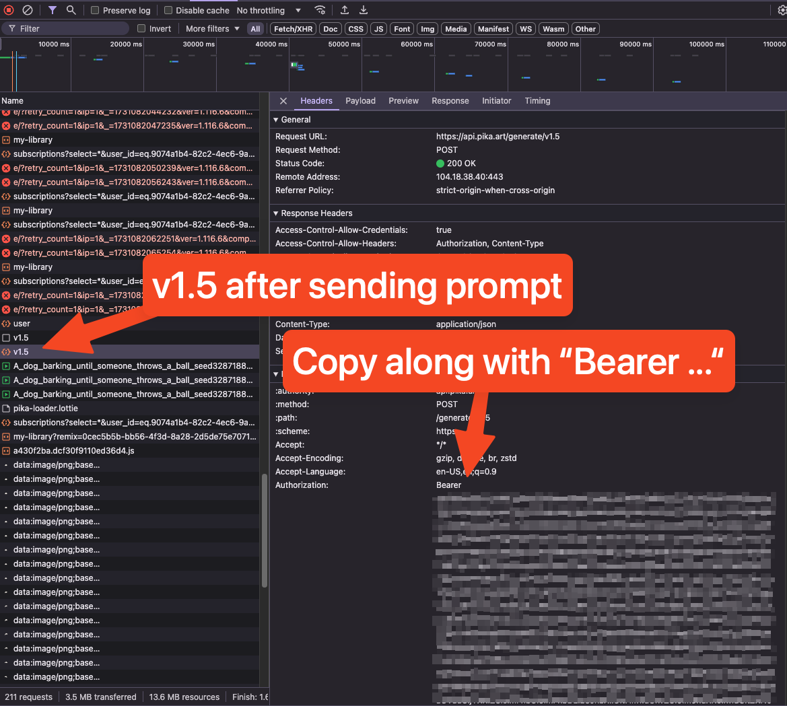
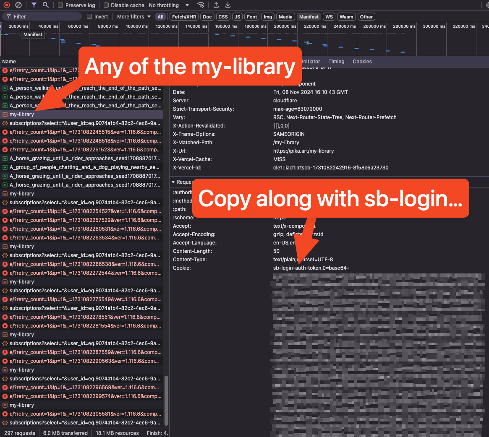

# Pika-Art-API
🎨 An unofficial API for Pika.art

## Usage

1. Clone the repository
2. Install the requirements
```script
pip install -r requirements.txt
```
3. We need two keys from [Pika.art](https://pika.art). You will need to login and use the browser's developer tools to get the keys. Submit a generation request and look for the `v1.5` request. The keys are in the headers under `Authorization`. Copy it along with the `Bearer` prefix. The second key is from any of the `my-library` requests. These should be populating automatically. Copy the `Cookie` header value along with the `sb-login` prefix. 
4. Copy the `example_config.yaml` file to `config.yaml` and fill in the keys.
5. Put your prompts in the `all_prompts.txt` file. Each prompt should be on a new line.
6. Run the main script
```script
python main.py
```

### Generate Authorization Key


### Library Cookie Key


> [!NOTE]  
> `main.py` calls generation requests parallely. It is extremely barebones. Feel free to modify it as you see fit. This codebase is provided as-is and do not expect any updates.
